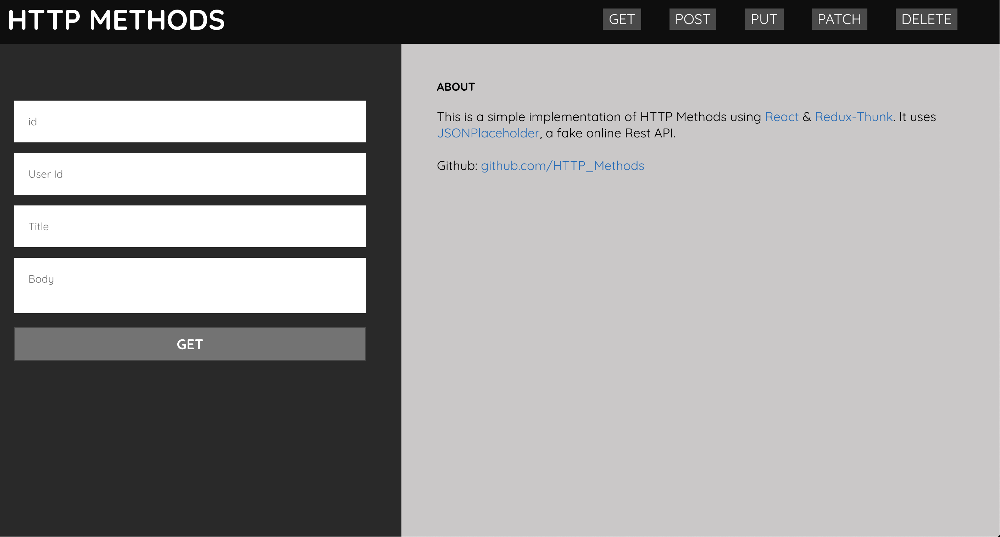
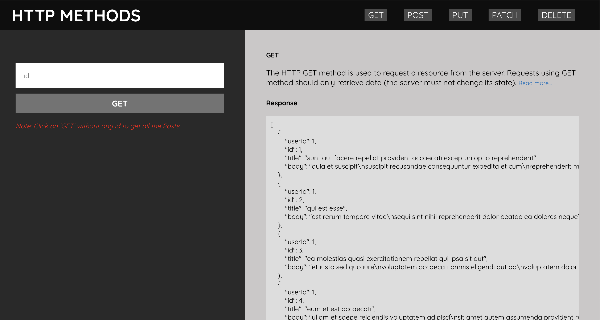
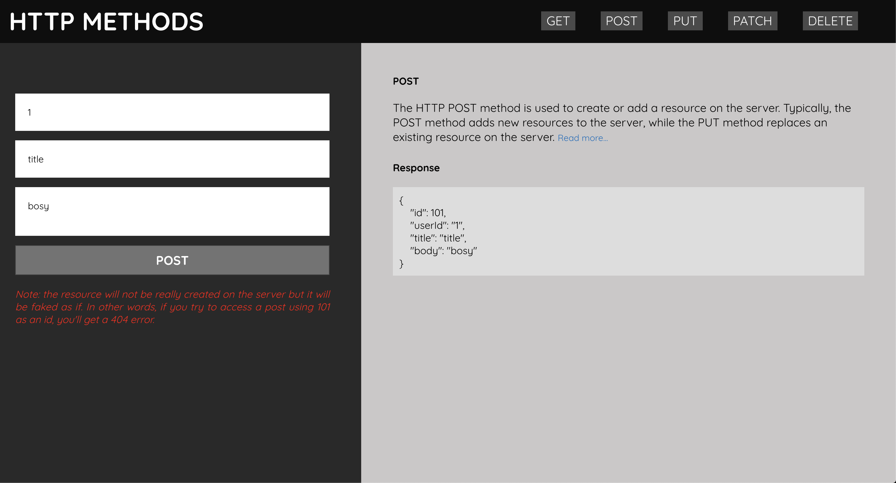

This project was bootstrapped with [Create React App](https://github.com/facebook/create-react-app).

## HTTP METHODS

This is a simple implementation of HTTP Methods using [React](https://reactjs.org/) & [Redux-Thunk](https://github.com/reduxjs/redux-thunk). It uses [JSONPlaceholder](https://jsonplaceholder.typicode.com/), a fake online Rest API.

<!--  -->




### GET STARTED

Install the dependencies...

```bash
cd rest_api
npm install
```

...then:

```bash
npm start
```

Navigate to localhost:3000. You should see your app running.
